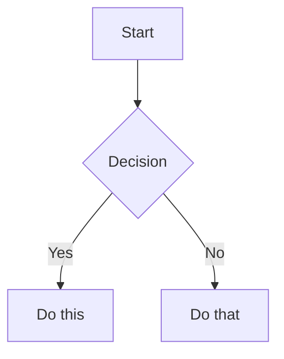

# Obsidian Flavored Markdown Skill

## Workflow: Creating an Obsidian Note

1. Add frontmatter with properties at the top
2. Write content using standard Markdown
3. Link related notes using wikilinks
4. Embed content using `![[embed]]` syntax
5. Add callouts using `> [!type]` syntax

## Internal Links (Wikilinks)

```markdown
[[Note Name]]                    Link to note
[[Note Name|Display Text]]       Custom display text
[[Note Name#Heading]]            Link to heading
[[Note Name#^block-id]]          Link to block
[[#Heading in same note]]        Same-note heading link
```

## Embeds

```markdown
![[Note Name]]                   Embed full note
![[Note Name#Heading]]           Embed section
![[image.png]]                   Embed image
![[image.png|300]]               Embed image with width
![[document.pdf#page=3]]         Embed PDF page
```

## Callouts

```markdown
> [!note]
> Basic callout.

> [!warning] Custom Title
> Callout with custom title.

> [!faq]- Collapsed by default
> Foldable callout.
```

**Types**: `note`, `tip`, `warning`, `info`, `example`, `quote`, `bug`, `danger`, `success`, `failure`, `question`, `abstract`, `todo`

## Properties (Frontmatter)

```yaml
---
title: My Note
date: 2024-01-15
tags:
  - project
  - active
aliases:
  - Alternative Name
cssclasses:
  - custom-class
---
```

## Tags

```markdown
#tag                    Inline tag
#nested/tag             Nested tag
```

## Comments

```markdown
Visible %%hidden%% text.

%%
Entire block hidden in reading view.
%%
```

## Obsidian-Specific Formatting

```markdown
==Highlighted text==    Highlight syntax
```

## Math (LaTeX)

```markdown
Inline: $e^{i\pi} + 1 = 0$

Block:
$$
\frac{a}{b} = c
$$
```

## Diagrams (Mermaid)

````markdown

````

## Footnotes

```markdown
Text with footnote[^1].

[^1]: Footnote content.

Inline footnote.^[This is inline.]
```
