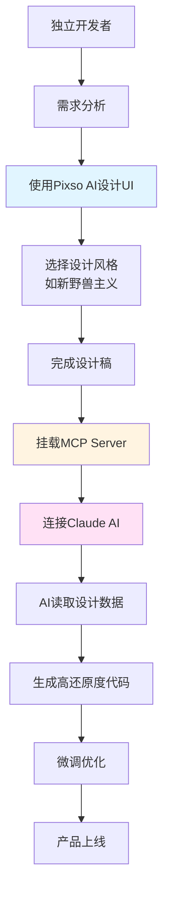

## 视频信息

- **作者**: 孙同学玩AI
- **粉丝数**: 1.8万
- **获赞数**: 20.7万
- **来源**: 抖音视频
- **链接**: https://v.douyin.com/ivUsMUt2_ew/
- **视频ID**: 7599999592515834212

## 核心痛点

> [!warning] 独立开发者的困境
> - ✅ 代码逻辑写得飞起
> - ❌ UI设计丑得想哭
> - 🎯 需要一套完整的AI辅助开发工作流

## 完整解决方案

### 一、AI驱动的UI设计阶段

#### 1.1 Pixso AI设计工具
- **工具**: Pixso AI（智能UI设计工具）
- **核心能力**: 
  - 智能生成UI设计稿
  - 支持多种设计风格
  - 自动化排版和配色

#### 1.2 实际案例：复刻"死了么"APP
- **目标**: 复刻知名外卖APP界面
- **设计风格**: 新野兽主义（Neo-Brutalism）
- **设计特点**:
  - 粗边框设计
  - 高对比度配色
  - 几何化元素
  - 复古与现代结合的审美

#### 1.3 新野兽主义风格要点
```
✓ 粗边框和阴影
✓ 鲜明的色彩对比
✓ 几何图形元素
✓ 扁平化但有质感
✓ 高可读性
```

---

### 二、MCP协议连接阶段

#### 2.1 MCP Server挂载
- **协议**: MCP（Model Context Protocol）
- **作用**: 建立设计工具与AI编程助手之间的桥梁
- **优势**: 
  - 无需手动复制设计数据
  - 保持设计与代码的一致性
  - 大幅提升开发效率

#### 2.2 工作流架构
```
Pixso设计稿 → MCP Server → Claude AI → 高质量HTML代码
     ↓              ↓            ↓            ↓
  视觉设计    数据传输    智能理解    代码生成
```

---

### 三、AI代码生成阶段

#### 3.1 设计稿数据读取
- Claude通过MCP协议直接访问Pixso设计稿
- 自动提取：
  - 颜色值（HEX/RGB）
  - 字体大小和间距
  - 布局尺寸
  - 组件结构
  - 交互状态

#### 3.2 高还原度HTML生成
- **输出质量**: 高还原度的前端代码
- **支持技术栈**:
  - HTML/CSS
  - React/Vue
  - Tailwind CSS
  - 其他现代前端框架

#### 3.3 开发效率提升
- 传统方式：设计 → 手动标注 → 编写代码（数小时/数天）
- AI方式：设计 → MCP连接 → 自动生成（分钟级）

---

## 技术栈详解

### 设计层
- **Pixso**: 协同设计工具 + AI设计助手
- **设计风格**: 新野兽主义（Neo-Brutalism）

### 连接层
- **MCP协议**: Model Context Protocol，模型上下文协议
- **MCP Server**: 负责设计数据的读取和传输

### 开发层
- **Claude**: AI编程助手
- **前端技术**: HTML/CSS/JavaScript/React/Vue等

---

## 完整工作流程图



---

## 关键优势

> [!success] 为什么这套方案有效？
> 1. **设计能力提升**: AI辅助设计，无需专业设计师背景
> 2. **一致性保证**: 设计稿直接转代码，减少人为误差
> 3. **效率大幅提升**: 从设计到代码的无缝衔接
> 4. **学习成本低**: 基于现有工具，易于上手
> 5. **可扩展性强**: 支持多种设计风格和技术栈

---

## 适用场景

- 🚀 独立开发者快速原型开发
- 💼 小团队产品迭代
- 🎓 学习AI辅助开发工作流
- 💰 低成本MVP验证
- ⚡ 快速交付项目

---

## 相关技术链接

- [Pixso官网](https://pixso.cn/)
- [MCP协议文档](https://modelcontextprotocol.io/)
- [Claude AI](https://claude.ai/)

## 相关笔记

- [[AI教程概述]]
- [[玩赚ChatGPT全攻略]]
- [[商业应用实战]]
- [[AI monetization/项目概述]]

---

## 行动清单

> [!todo] 下一步行动
> - [ ] 注册Pixso账号并体验AI设计功能
> - [ ] 学习MCP协议基础概念
> - [ ] 尝试使用Claude进行AI编程
> - [ ] 复刻一个简单的APP界面练手
> - [ ] 搭建自己的AI开发工作流

---

*笔记创建于 2026-04-16，基于孙同学玩AI的抖音视频整理*
